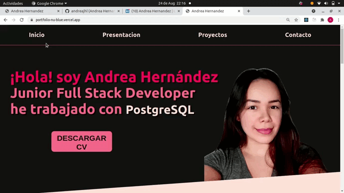
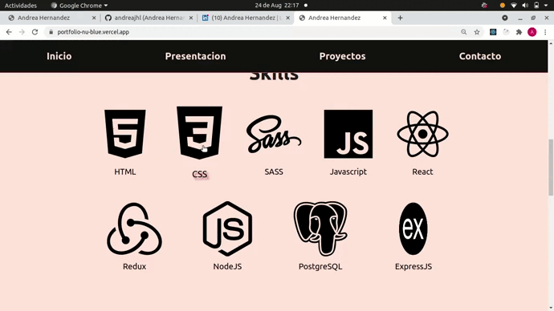
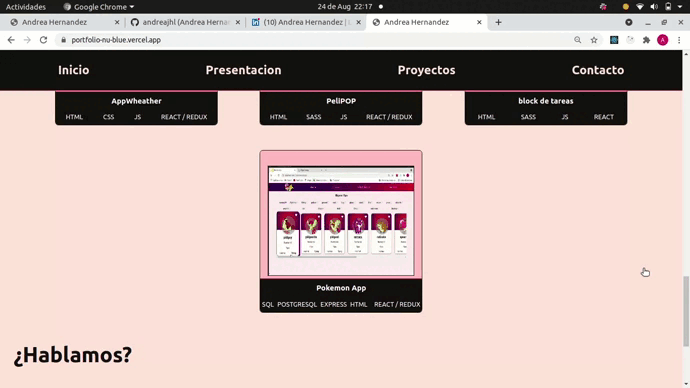

# Portfolio

 Esta simple page es mi portfolio, esta realizada usando React y SASS, el en podes encontrar algunas muestras de mis trabajos practicos, mis medios de contacto, conocer un poco mas sobre mi y las tecnologias que trabajo
 
 

### CLONAR REPOSITORIO

* #### $ git clone https://github.com/andreajhl/portfolio.git
 
 

### PROBAR

### Después de clonar este repositorio.

* Ingresar a la carpeta del proyecto desde tu editor de codigo favorito.
* Abre la consola del proyecto
* En la terminal del proyecto ejecute la línea de comando, 'npm install'
* Al culminar la instalacion ejecute 'npm start' para arrancar el proyecto.
 
 

### TECNOLOGIAS USADAS

* #### HTML5
* #### SASS
* #### Javascript
* #### ReactJS

 
 

### PANTALLAS DEL PROYECTO Y USOS

* ### Home
 

 Aca vas a encontrar la barra de navegacion, posee cuatro items, al clickearlos te desplazaran lentamente sobre la pantalla hasta la parte de la pagina, que quieras ver, tenes un boton rapido para descargar el cv 
  

 En la pestaña de presentacion, cuento un poco de mi y como llegue al mundo de la tecnologia y podes ver algunas de las tecnologias que trabajo
 

 

* ### Proyectos
 

 A traves de estas tarjetas podes ver en un pequeño gifs un ejemplo de uso de las aplicaciones, las tecnologias que use, ademas al colocar el mause sobre ella el gifs se dezplazara para que puedas leer algunos detalles extras
 

 
 

* ### Contacto
 

En esta parte tenes los medios por los cuale spodes contactarme, el boton de gmail te copia en el portapeletes mi correo, tenes dos links, uno de ellos te redirige a mi Likedin y otro a mi Github, y por ultimo tenes otro boton para descargar el cv en pdf
 

